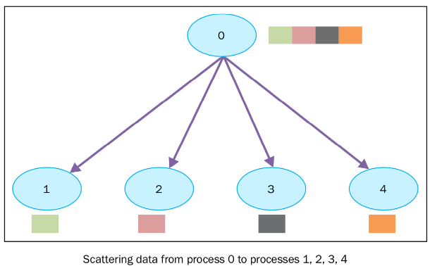

# Pre-train
本文基于综述论文[Pre-Trained Models: Past, Present and Future](https://arxiv.org/abs/2106.07139)对近下具有广泛研究前景的预训练模型进行梳理和学习。
## 一 什么是预训练模型
由于sophisticated pre-training objectives和huge model  parameters,  预训练模型能够数据中获取到知识，而这些所谓的知识就蕴藏在参数里面，并且能够应用于下游任务。  

目前来说，业界已经形成一种共识：adopt  PTMsas backbone for downstream tasks rather than learning  models  from  scratch。   

一般来说，提高预训练模型性能的方向有：designing  effective  architectures,  utilizing rich contexts,  improving com-putational efficiency, and conducting interpretation and theoretical analysis  

常见的深度神经网络有：CNNs、RNNs、GNNs和attention neural networks。但是他们有一个关键性的问题就是data hungry，如果没有足够的训练数据的话，它们非常容易产生overfit and have poor generalization ability的问题  

针对该问题，前人的想法是收集人工标注的高质量数据集，显然该做法是十分昂贵的。*how to train effective deep neural models for specific tasks with limited human-annotated data*一度成为当时的热门议题。  

受到人类学习机制的启发，transfer learning应运而生。其框架为：a pre-training phase to capture knowledge from one or more source tasks,and a fine-tuning stage to transfer the captured knowledge to target tasks  

与CV不太一样的是，NLP常常会利用自监督学习，即leverage intrinsic correla-tions in the text as supervision signals instead ofhuman supervision.   

the problem of vanishing or ex-ploding gradients一度是NLP中的痛点。为此，NLP采用了如Word2Vec、GloVe来捕捉单词的语义信息，但是它们一个单词只能用一个向量来表示，无法解决一次多义等问题  

transformers的出现让更加深层的神经网络成为可能，当然，increasing computationalpower boosted by the wide use of distributed com-puting devices and strategies也是PTM流行的一种重要诱因。  

PTM的基本问题有：不清楚隐层参数的意义以及巨大的计算资源   

## 二 预训练模型的背景知识
### Transfer Learning and Supervised Pre-Training
从定义来说，迁移学习是指：transfer learning aims to capture important knowledge from multiple source tasks and then apply the knowledge to a target task.  

显然，source tasks和target tasks的一致性是我们首先需要考虑的问题，pre-training methods往往是连接这两者的桥梁  

一般来说，有两种迁移方法：feature transfer  and  parameter  transfer  

从AlexNet到VGG和GoogleNet，网络变得越来越深，性能也相应的会越来越好，但会带来 vanishing or exploding gradients的问题。此外，model performance may soon meet a ceiling and then degrade rapidly with continually increasing network depths.  

ResNet通过正则化和残差层的方式，解决了这一问题。Based on the combination of effective model ResNet, informative dataset ImageNet, as well as mature knowledge transfer methods, a wave of pre-training models on labeled data emerges. CV界很多的做法都是用ResNet在ImageNet上进行预训练，之后应用到图像识别等下游任务上。而在NLP领域，CoVE是一个相应的工作。    

随着人们意识到无标注数据的价值，自监督应运而生。Self-supervised learning has been proposed to extract knowledge from large-scale unlabeled data by leveraging input data itself as supervision.其实自监督学习是无监督的一个分支，不同的是后者只是检测出数据的模式（如聚类），而前者更像监督学习。 

Compared to supervised pre-training working as the cornerstone of CV in the deep learning era, self-supervised pre-training allows for huge advances in the field of NLP.    

The recent stunning breakthroughs in PTMs are mainly towards NLP tasks, more specifically pre-trained language models.  

Using word embeddings as the input of neural models has almost become the common mode for NLP tasks.    

After Vaswani et al. (2017) propose Transformers to deal with sequential data, PTMs for NLP tasks have entered a new stage, because it is possible to train deeper language models compared to conventional CNNs and RNNs.   

With the recent advance of PTMs for NLP tasks,applying Transformer-based PTMs as the backbone of NLP tasks has become a standard procedure.之后，CV也尝试self-supervised learning + tansformer的方法，甚至有Transformer-based multimodal PTMs。   

The key to the success ofrecent PTMs is an integration of self-supervised learning and Transformer.其中最具代表性的莫过于autoregressive language modeling的GPT，以及autoencoding  language modeling的BERT，后续的PTMs都是两者的变种。  

### Transformer
Between neural layers,residual connection (He et al., 2016) and layer nor-malization (Ba et al., 2016) are employed, making it possible to train a deep Transformer.  

众所周知，该模型是在[Attention Is All You Need](https://arxiv.org/abs/1706.03762)中被提出的，详情可见我写的这篇[博客](论文解读/Attention%20Is%20All%20You%20Need.md)。
- BERT  
  使用了MLM，即随机掩盖掉一些单词，预训练任务就是利用这些被掩盖单词的上下文来预测该单词，显然，这里是双向的。公式上为$L(X)=\sum_{i-=1}^mlogP([Mask]_i=y_i|\tilde X;\Theta)$另外，还有一个NSP任务，但是后来证明，该任务并无实际作用。 
- GPT       
  GPT是第一个将transformer架构和自监督训练结合起来的模型，其使用的是自回归语言模型，即最大化所有单词在给定前述单词的条件概率，公式上为$L(X)=\sum_{i=1}^{n+1}logP(x_i|x_{i-k},....,x_{i-1};\Theta)$
- After GPT and BERT  
  - RoBERTa
    - 去除NSP任务
    - 更大的训练步数、batch size，更多的数据
    - 更长的训练句子
    - 动态改变mask的方式
  
  - AlBERT
    - 把输入的word embedding矩阵分解为更小的两个
    - transformer层之间共享参数
    - 用SOP代替NSP  
  

## 三 最新研究方向
### **Designing Effective Architectures**   

BERT之后的模型架构可分为两个设计思路
- Unified sequence modeling  
  NLP具有挑战性的一个基本问题就是其多样的下游任务，包括$Natural ~language~understanding,Open-ended~language~generation,Non-open-ended ~language ~generation$。但是观察发现，我们不必太过在意各种下游任务的区别，它们的界限是模糊不清的。换句话说，它们之间是可以进行转换的。基于该发现，后续的工作在需求使用一个PTM来统一不同任务的方式。这块的挑战是，encoder-decoder架构参数更多、NLU效果更差。
  - Combining Autoregressive and Autoencoding
Modeling  
    - XLNet：使用premutated language modeling将GPT-style
unidirectional generation和BERT-style bidirectional understanding结合了起来
    - MPNet：改进了XLNet在预训练是不知道序列长度，但是下游任务知道的问题
    - UniLM：使用multi-task training，即将包括unidirectional, bidirectional, and seq2seq objective连接进来训练
    - GLM：
  - Applying Generalized Encoder-Decoder   
    - MASS
    - T5
    - BART
  
- cognitive-inspired architecture  
  这里是介绍受人类感知系统启发的模型架构
  - Maintainable Working Memory   
  固定的窗口大小和指数级的空间复杂度限制了transformer在长文本上的理解和生成。人类的记忆机制为 *not only memorizes and organizes but also forgets*，LSTM便是一个典型的应用。
    - Transformer-XL:introduce segment-level recurrence and relative
positional encoding
    - CogQA:PTM+GNN
    - CogLTX:解决CogQA固定窗口的问题
  - Sustainable Long-Term Memory  
  Besides working memory for deciding and reasoning, the
long-term memory also plays a key role in recalling facts and experiences.
    - REALM:construct a sustainable external memory for Transformers
    - RAG:extends
the masked pre-training to autoregressive generation, which could be better than extractive question answering.

- optimizing BERT's architecture  
  改进掩码策略和更加为更难的掩码预测目标
  - Span-BERT:masking a continuous random-length span of tokens with a span boundary objective (SBO)
  - ERNIE:a whole entity is masked
  - NEZHA:
  - Whole Word Masking
  - ELECTRA：transform MLM
to a replace token detection (RTD) objective, in
which a generator will replace tokens in original
sequences and a discriminator will predict whether
a token is replaced

### **Utilizing Rich Contexts**
- Multilingual Pre-Training  
  虽然世界上的语言都不相同，但是它们可以表达一样的意思。实验证明，使用多语言进行训练，能够得到更好的性能。因此，学习multilingual representation可能是一个更好的方式。这里主要有两种学习方法：learn through parameter sharing和learn language-agnostic
constraints   
  - mBERT：pretrained with the multilingual masked language
modeling (MMLM) task using **non-parallel** multilingual Wikipedia corpora in 104 languages
  - XLM-R：XLM-R is pretrained with MMLM as the only task on
 Multimodal Pre-training **CC-100**，性能更好的原因是CC-100数据集更大
  - XLM：MMLM不能很好地利用parallel corpus，XLM利用**bilingual sentence pairs** to perform the translation language modeling
(**TLM**) task.This encourages models to align the representations of two languages together.
  - Unicoder：provides two novel pre-training tasks based on parallel corpora: cross-lingual word recovery (**CLWR**)
and cross-lingual paraphrase classification (**CLPC**).
  - ALM： automatically
**generates code-switched sequences** from parallel
sentences and performs MLM on it, which forces
models to make predictions based only on contexts
of other languages.
  - InfoXLM：analyzes MMLM and TLM from the perspective
of information theory, and encourages models to
distinguish aligned sentence pairs with misaligned
negative examples under the framework of **contrastive learning**
  - HICTL：extends
the idea of using contrastive learning to learn both
sentence-level and word-level cross-lingual representations.
  - ERNIE-M：proposes **back-translation masked language modeling**
(BTMLM), and expands the scale of parallel corpora through back-translation mechanisms.
  - mBART：extends **DAE**(replacing a span of tokens with a mask token
as well as permuting the order of tokens) to support multiple
languages by adding special symbols. It adds a language symbol both to the end of the encoder input
and the beginning of the decoder input. This enables models to know the languages to be encoded
and generated.
  - XNLG：proposes
the cross-lingual autoencoding (**XAE**) task. Different from DAE, the encoding input and the decoding
output of XAE are in different languages, which is
similar to machine translation.In addition, XNLG
optimizes parameters in a **two-stage manner**. It
trains the encoder with the **MLM and TLM tasks** in
the first stage. Then, it fixes the encoder and trains
the decoder with the **DAE and XAE tasks** in the
second stage. All parameters are well pre-trained
by this way, and the **gap** between pre-training with
MLM and fine-tuning with autoregressive decoding
is also filled.
- Multimodal Pre-training  
  一般来说，多模态工作大部分都是VLM，image and video belong to vision while text and speech belong to language.目前的多模态PTM主要关注三个方面：(1) improving model architecture, (2) utilizing more data, and (3) designing
better pre-training tasks   
目前大部分的工作都是基于visual-linguistic BERT的架构。而主要的挑战是如何将视觉和语言内容对齐到同一语义空间上，为了解决该问题，当前主要有两种设计架构：two-stream和single-stream。前者有ViLBERT和LXMERT；后者有VisualBERT、Unicoder-VL和B2T2。考虑到模型简单和参数效率，单流会是大部分人的选择。  
而在数据集方面，有*Conceptual Captions ,SBU Captions ,COCO , Flicker30K , GQA ,VQA and Visual Genome*   
UNITER就使用了上述的一些数据集来进行训练，充足的数据让它取得了不错的效果。ImageBERT进一步加入了一千万image-text pairs进行训练，VL-BERT加入了text-only corpora   
至于在预训练任务方面，有**MLM**, sentence-image alignment (**SIA**), masked region classification (**MRC**),
masked region feature regression (**MRFR**), and **directly incorporating downstream tasks**(LXMERT直接使用VQA)  
为了学习更细粒度的表示，UNITER提出了word-region alignment task in the way
of Optimal Transport, which
first finds a sparse matching between image regions
and words, and then minimizes the alignment distance.   
然而，上述的工作都忽略了**object tags**’ function as a kind of explicit bridges
between image regions and text tokens，为此，**Oscar**  proposes to concatenate
the object tags with original image-text pairs as anchors to learn the alignment between V&L modalities, and designs a new pre-training task for image-tag sequence-caption alignment judgment.   
并非直接设计预训练任务，**CLIP**和**WenLan** grasp the V&L
grounding ability in a simple and holistic regime。They encode images and captions into **holistic** visual and text representations rather than **separated**
region features and word embeddings, and then
only conduct an image-text retrieval task.这类整体对其方式的成功要归功于大规模的数据。   
上述模型可以用于V&L understanding和image captioning任务，但是无法用于image generation。**DALLE**展示了多模态PTM可以连接文本描述和图像生成。**CogView** further improves the
numerical precision and training stability by introducing sandwich transformer and sparse attention
mechanism     
最后，除了image-text PTMs，还有其他模态的，如VideoBERT、SpeechBERT

- Kownledge-enhanced Pre-training  
  **knowledge graphs**, **domain specific data** and **extra annotations of pre-training data**, is the outcome of human wisdom which can be a good prior to the modeling of statistics.(如果有应用需要可能看原文中提及的一些工作)
### **Improving Computational Efficiency**
  虽然PTM的趋势是参数量越来越大，准确率也相应提升。但是，同时训练模型所需的空间和计算开销也增加了。因此，下面将介绍三种提升计算效率的方法。
  - System-Level Optimization    
  系统级优化一般是model-agnostic，并且不会改变底层的训练算法，因此可以用于训练大规模的PTM
    - Single-Device Optimization    
  大量的空间消耗主要是因为redundant representation
of floating-point numbers。当前的深度学习系统主要基于FP32，但是模型的权值一般只处于一个有限的范围内，因此使用FP16已经并不会有太多的精度损失。   
话虽如此，但是在使用FP16进行训练可能会失败，原因是**floating-point truncation and overflow**。为了解决该问题，mixed-precision training methods应运而生，他的做法是preserve some
critical weights in FP32 to avoid the floating-point
overflow and use dynamic loss scaling operations
to get rid of the floating-point truncation。但是当模型参数初始化得不好时，该方法仍然会造成训练不稳定    
此外，the activation states saved for computing gradients也是冗余的，就比如实际上我们需要的是attention layers和linear layers，但是隐藏层我们也是需要大量内存进行存储的。基于此，Gradient checkpointing
methods have been used to
save memory by storing only a part of the activation
states after forward pass. The discarded activation
states are recomputed during the backward steps if
necessary.     
最后，近来也有尝试将模型参数和激活状态放到CPU而非GPU，如ZeRO-Offload，因为前者内存更大
    - Multi-Device Optimization   
  随着预训练模型的规模越来越大，分布式训练的思路也自然产生了，主要包括了data parallelism和model parallelism。在数据并行时，我们将一个大的batch划分到多个结点，在前向传播时，可以并行，在反向传播时，梯度需要汇集到一起。可以看到，这样会带来通信开销。    
  另一方面，模型的参数量往往十分庞大，使用一个GPU内存不足，因此我们可以考虑模型并行。具体做法就是，将模型参数划分到多个结点，而如reduce-scatter、all-gather的通信操作可以保证前行传播和反向传播的正确性。如**Megatron-LM**把self-attention heads和feed-forward layers分到了不同的GPU、**Mesh-Tensonflow**可以让用户把向量划分到不同的维度。   
  模型并行在前向传播和反向传播时都需要进行通信，而数据并行只需要在反向传播时进行通信，因此当内存足够时，后者会是更好的选择。   
  ZeRO通过在数据并行进程之间划分OGP模型状态而不是复制它们来消除数据并行进程之间的内存冗余，在训练过程中采用动态通信调度，保持了和数据并行基本一致的计算粒度和通信量，从而保持了计算/通信效率。  
  前面的模型并行是通过并行矩阵操作实现的，但是pipeline parallelism也是一种模型并行的方式。把每一个层划分到一个结点，一个结点计算结束之后把结果传到下一个结点，因此通信开销相对要少很多。相关工作有GPipe、TeraPipe。
  

  

    
    

  - Effective Pre-Training  
  预训练阶段的优化主要可以分为任务和架构。
    - Effective Training Methods    
  传统的预训练任务都比较地sample-inefficient，比如MLM，mask比例通常为15%，也就是说只有少部分信息可以学习到。基于此，ELECTRA改用了replaced token detection任务，相较于前者，这里模型利用的监督信息更多了，因为它需要判别每一个单词是否被替换了。    
  另外，MLM通常时随机mask的，训练过程会有点aimless和inefficient。因此，一些工作会选择基于单词的重要性或者在反向传播的梯度来加速训练。  
  pre-training dynamics通常也是次优化的。PTM需要大的batch size，但是会增加优化的难度。因此，他们提出了warmup strategy。另外，PTM一般由多个如transformer的基础结构堆叠而成。研究表明，some recent works study Transformer based models and claim that different layers can share similar self-attention patterns.因此，我们可以尝试先训练一个shallow model，然后将其进行复制，从而构建一个deep model。Some layers can also be **dropped** during training to reduce the complexity of back-propagation and
weight update (Zhang and He, 2020). In addition,
You et al. (2017) and You et al. (2020) find that
adaptively using **different learning rates** at different layers can also speed up convergence when the
batch size is large.
    - Effective Model Architectures     
  对于tansformer-based PTM来说，它们的对attention weigth的计算会随着输入序列的长度呈指数级增长。    
  Some
works (Peng et al., 2021; Choromanski et al., 2021;
Wang et al., 2020c; Katharopoulos et al., 2020) design **low-rank kernels** to theoretically approximate
the original attention weights and result in linear
complexity. Some works (Child et al., 2019) introduce sparsity into attention mechanisms by limiting
the view of each token to a fixed size and separating
tokens into several chunks so that the computation
of attention weights takes place **in every single
chunk rather than a complete sequence**. Compared
to predefined chunks, some works (Roy et al., 2021;
Kitaev et al., 2020) find that **using learnable parameters to assign tokens into chunks** results in better performance. Another kind of methods (Guo
et al., 2019; Lee et al., 2019; Beltagy et al., 2020;Ainslie et al., 2020; Zaheer et al., 2020) combine
global and local attention mechanisms, and then
use global nodes to gather tokens in a sequence. In
this way, the long sequence is compressed into a
small number of elements so that we can reduce
the complexity.   
最后，我们发现，在保持一样的计算复杂度的情况下，一些transformer的结构变种也可以帮助加速收敛。Mix-of-experts(**MoE**)可以使得在增加模型参数的同时而保持相同的计算复杂度，**Switch Transformer**便使用了这一项技术。

  - Model Compression   
  通过模型压缩，将大模型变为更小的，从而满足更快的推理和在资源受限设备上的应用。
   - Parameter Sharing  
  PTM可以通过在相似单元之间共享参数的方式进行压缩。**ALBERT**就使用了factorized embedding parameterization and cross-layer parameter sharing。它的成功也暗示了PTM可能是**over-parameterized**

   - Model Pruning    
  所谓模型剪枝，就是去掉一些无用的部分。   
  In (Fan et al., 2019), Transformer layers
are **selectively dropped during training**, resulting in
a more shallow model during inference. In (Michelet al., 2019), (Voita et al., 2019) and (Zhang et al.,
2021b), researchers study the **redundancy of the
attention heads** in Transformers and find that only
a small part of them is enough for good performance. Most of these heads can be removed with
little impact on the accuracy. Other trials such as
CompressingBERT (Gordon et al., 2020) try to
**prune the weights of attention layers and linear layers** to reduce the number of parameters in PTMs,
while maintaining the comparable performance to
the original model.

   - Knowledge Distillation    
  知识蒸馏的做法是training a small model to reproduce the
behavior of a large teacher model。比如ALBERT虽然减少了内存消耗，但是推理时间却没有减少。这里的相关工作有DistillBERT、TinyBERT、BERT-PKD、MiniLM。这里的问题是教师模型的训练数据一般是不公开的。
   - Model Quantization   
  模型量化一般用于CNN-based model，做法就是compression of higher-precision floating-point parameters to lower-precision floating-point ones.传统的PTM使用32或者16
  bit进行表示，通过量化可以使用8甚至1、2bit表示。  
   For recent Transformer-based
models, 8-bit quantization has been proved to be effective for model compression in **Q8BERT** (Zafrir
et al., 2019), with little impact on the model performance. Despite this, training 1 or 2 Bits models
remains challenging due to the significant decrease
in model capacity. To alleviate the performance
degradation, other methods to preserve the accuracy can also be employed. **Q-BERT** (Shen et al.,
2020a) uses mixed-bits quantization in which the
parameters with higher Hessian spectrum require
higher precision while those parameters with lower
Hessian spectrum need lower precision. **TernaryBERT** (Zhang et al., 2020b) applies knowledge
distillation in quantization, forcing low-bit models
to imitate full-precision models. Both Q-BERT and
TernaryBERT result in ultra low-bit models.    
但是，模型量化是一项高度硬件相关的，也就是说你只能用到支持low-bits represntation的设备上

### **Theoretical Analysis**
除了不断追求PTM更好的效果，一些研究也尝试揭开其神秘的面纱，了解其工作原理、捕捉的是什么信息。
- Knowledge of PTMs   
  PTM学习到的知识可以分为两类。
  - Linguistic Knowledge  
  相比于CNNs、RNNs，大规模的PTM可以学习到更丰富的语言知识。为了探究PTM的语言知识，主要有四种策略
    - **Representation Probing**: Fix
the parameters of PTMs and train a new linear layer
on the hidden representations of PTMs for a specific probing task. It is the most popular approach
because it can be easily adapted to any probing
task without particular design.
    - **Representation
Analysis**: Use the hidden representations of PTMs to compute some statistics such as distances or similarities. According to these statistics, we can construct the relation between different words, phrases,
or sentences.
    - **Attention analysis**: similar to
representation analysis, attention analysis compute
statistics about attention matrices and is more suitable to discover the hierarchical structure of texts
    -  **Generation Analysis**: Use language models to
directly estimate the probabilities of different sequences or words. The target texts could be correct
or incorrect in some linguistic phenomenons.    

     原文中介绍了使用了这四种策略的一些工作，也是比较地具有启发性，并且得到了一些关于PTM本质上的结论，这里就不一一列举了。
  - World Knowledge   
  这里原文中也介绍了两类知识，并给出了对应的工作。
    - commonsense knowledge
    - factual knowledge
- Robustness of PTMs  
  研究发现，PTM在adversarial example时存在严重的健壮性问题。对抗样本是指在自然样本上添加微小的扰动而形成的样本, 相较于原有样本, 此类样本的改变通常不影响肉眼判断, 甚至于肉眼不可见, 但可以使训练好的模型以高置信度得出与原有样本不同的输出。
- Structural Sparsity of PTMs    
  研究发现，transformer是over parameterization的。    
  Researchers have shown that the
**multi-head attention structures are redundant** in the
tasks of machine translation (Michel et al., 2019),
abstractive summarization (Baan et al., 2019), and
language understanding (Kovaleva et al., 2019),
i.e., when removing part of attention heads, we can
achieve better performance. This phenomenon is
consistent to the observation in (Clark et al., 2019)
where they find that **most heads in the same layer
have similar self-attention patterns**. Furthermore,
Kovaleva et al. (2019) conduct a qualitative and
quantitative analysis of the information encoded
by PTMs’ heads. Their findings suggest that the
attention behaviors of **different heads can be categorized into a limited set of patterns**. Besides the
multi-head attention, several other works explore
to identify the **sparsity of parameters**. Gordon et al.
(2020) show that l**ow levels of pruning (30-40%)**
do not affect pre-training loss or the performance
on downstream tasks at all. Targeting the sparsity
during fine-tuning, Prasanna et al. (2020) validate
the lottery ticket hypothesis on PTMs and find that
it is possible to **find sub-networks** achieving performance that is comparable with that of the full
model. Surprisingly, Kao et al. (2020) show that we
can improvement the performance by **simply duplicating some hidden layers** to increase the model
capacity, which suggests that the **redundant parameters may benefit the fine-tuning**.   

Erhan et al. (2010) propose two hypotheses to explain the effect of pre-training: (1) **better optimization** and (2) **better regularization**.前者的解释是预训练过的网络相较于随机初始化的更接近全局最小值。后者的解释是PTM虽然训练误差没有更小，但是测试误差更小了，这就是正则化的功劳。进来，我们也发现，基于**对比学习**的预训练已经成为了主流。    

## 四 未来工作方向
悟已往之不谏，知来者之可追！既然我们已经洞悉预训练模型的前世与今生，那么我们不妨去追寻一番它未来的脚步。   
具体来说可以分为七个方向
- **Architectures and Pre-Training Methods**   
  - **New Architectures**：transformer已经被证明是一个有效的结构，但是它的局限在于**计算复杂度**。受限于GPU的内存，序列长度一般都不能超过512个token。因此，一个挑战就是寻找可以捕捉**长文本**信息的结构。但是设计一个深度的网络架构往往比较困难，因此我们可以尝试一些自动化方法，如**neural architecture search**(NAS)。另一个问题就是，大规模的PTM不适用于**低容量或者低延迟**的设备与应用。最后一个是，不同的下游任务最好的架构往往是不同的，就比如decoder适合NLG，而encoder适合NLU。Therefore, we may need to carefully design **task-specific architectures** according to the type of downstream tasks.   
  - **New Pre-Training Tasks**； 可以学习到通用知识的general-purpose
PTMs是我们的追求。但是这样的PTM需要更深的结构、更多的数据、更难的预训练任务，这也意味着更大的训练开销，因此，a more practical
direction is to design more efficient self-supervised
pre-training tasks and training methods according
to the capabilities of existing hardware and software。ELECTRA便是一个很好的尝试。 
  - **Beyond Fine-Tuning**：当前来说，fine-tuning实际那个知识从PTM迁移到下游任务的主流方法。但是它有一个问题，就是parameter inefficiency，即每一个下游任务都有自己的fine-tuned参数。一个改进的方法是fix the original parameters of PTMs and
add small fine-tunable adaption modules for specific tasks。随着GPT-3的诞生，一种称为prompt tuning的微调方式也出现在了大家的视野。它的作用包括 (1) bridge the gap between pre-training and
fine-tuning, and thereby perform better on downstream tasks; (2) reduce the computational cost on
fine-tuning the tremendous amounts of parameters.显然，这个方法具有光明的研究前景。  
  - **Reliability**：将PTM用到生产环境的话，我们不得不考虑其可靠性。adversarial attacks不仅证明了PTM的能力，也暴露了它的脆弱性。因此，也有研究Adversarial defences的，以提高它应对攻击的健壮性。

- **Multilingual and Multimodal Pre-Training**  
  - **More Modalities**：我们可以加入视频和音频数据，但是问题是要考虑将时序信息也进行建模。另外，比如对于video-text pairs，传统的自监督方法因为计算开销太大不能使用，因此，it is important to develop more effective
and efficient self-supervised learning methods for
more complex modalities.

  - **More Insightful Interpretation**：the latest visualization tools for deep learning
can be exploited for the interpretation of multimodal pre-training

  - **More Downstream Application**： it is still challenging to find a
“true” real-world application scenario for multimodal pre-training, since many effective engineering tricks can be leveraged instead
  - **Transfer Learning**： a new pretraining framework should be explored to easily adapt to those unseen languages.ow to directly transfer the source language
audio to the target language text or target language
audio by multimodal multilingual PTMs is also
worth exploring.
  
- **Computational Efficiency**  
  像tenseorflow和pytorch这些都没有预见到像大模型中的并行需要。  
  - **Data Movement**：针对分布式深度学习框架，我们需要考虑高效地移动设备之间的数据，最好还能自动化生成这些并行策略。
  - **Parallelism Strategies**：Particular to the choice
of parallelism strategy, data parallelism, model
parallelism, pipeline parallelism, and various hybrid parallelism approaches can find their best usage depending on the structure of neural networks
and hardware configuration
  - **Large-Scale Training**：考虑到当前深度学习框架下对模型并行和流水线并行的支持比较差，一些工作会选择直接构建用于大模型的深度学习框架，如HugeCTR、Megatron-LM、DeepSpeed、Insight-Face等。
  - **Wrappers and Plugins**：Without a mechanism to
support model parallelism and pipeline parallelism,
one has to develop various libraries dedicated to
some particular algorithms via inserting the data
routing operations by hand between computing operations on top of existing frameworks.If communication operations can be automatically managed transparently
to users by deep learning frameworks, more models
and applications can benefit from the distributed
training.To support more complicated parallelism strategies, many schemes are used as wrappers or plugins based on some mainstream deep learning
frameworks such as TensorFlow and PyTorch.The automatic scheduling
of parallelism strategies is the trend of distributed
training in the future.

- **Theoretical Foundation**   
  - **Uncetainty**：One under-addressed issue with
PTMs (as well as other deep neural networks) is
that they are often **over-confident** in predictions,
i.e., these models do not know what they do not
know. It is generally a challenging task to deal with such **out-of distribution** (OOD) data in machine learning.To address the above challenge, one promising
direction is to adopt **Bayesian methods** that explore
probabilistic tools to capture the uncertainty of both
data and model or derive some testing statistics.

  - **Generalization and Robustness**：it
is important to theoretically understand the roles
of pre-training in improving the generalization of
downstream tasks.it was shown that a higher sample complexity is
needed in order to achieve adversarial robustness
for neural networks.
- **Modeledge Learning**   
  区别于知识在人脑中是以离散符号表示的，在PTM中是以实数向量表示的，称为modeledge(模识)。
  - Knowledge-Aware Tasks：From all these knowledge-aware tasks, we can find
that a wealth of human knowledge is captured by
PTMs and stored in the form of modeledge. How to
stimulate the modeledge of PTMs is worth further
exploring in the future
  - Modeledge Storage and Management：不同的PTM需要不同的模型结构和训练数据，因此，如何管理和存储这些多样的modeladge成为了一个挑战。目前来说有两种方法，第一，用海量的数据训练一个可以cover多个modeledge的大模型，如GPT3。第二个就是基于mixture of experts (MoE)将多个模型结合成一个大模型，如switch transformer。另外，业界提出一个问题：is it
possible to build a universal continuous knowledge
base (UCKB) that stores modeledge from various
PTMs?
- **Cognitive and Knowledgeable Learning**   
  令PTM更“博学”有三个方法
  - Knowledge Augmentation：可以利用一些相关的知识来增强输入，it is important to bridge the gap between
text representations and knowledge representations
(including symbols or vectors) and use their information uniformly as input.The solution to this
problem requires both unified model architectures
and knowledge-guided pre-training objectives.

  - Knowledge Support：With prior knowledge about the input, we can train
different sub-module to process different kinds of
input, which may accelerate the process of training
and inference and benefit the model efficiency.
  - Knowledge Supervision：By
learning from both knowledge bases and large scale corpora, PTMs can have better language understanding and generation abilities compared to
only using plain text.  
 
  关于构建认知PTM，也有三种方法
    - Cognitive Architecture：, it is expected to see how the macro
function and organization of human cognitive system can enlighten the design of the next generation
of intelligence system, such as the Global Working Theory (GWT).相关工作有CogQA、CogLTX。
    - Explicit and Controllable Reasoning：how to conduct complex decision
making and efficient multi-step reasoning is still
unsolved, which may require machines to automatically plan the decision making process into a
cognitive graph and do explicit reasoning over the
factors in graphs as human do.相关工作有InversePrompting 
    - Interactions of Knowledge：it is important to see if our PTMs have shaped different inner function modules and how they would
interact with each other.
- **Applications**
