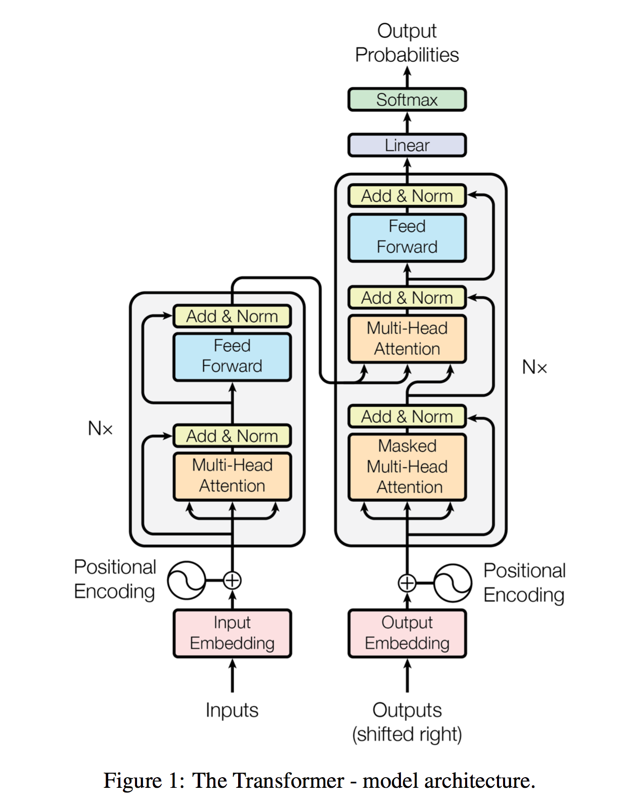

# Attention Is All You Need

- [论文](https://arxiv.org/pdf/1706.03762.pdf)  
- [代码](https://github.com/tensorflow/tensor2tensor)
- [解析](https://blog.csdn.net/nocml/article/details/103082600)
- [视频](https://www.bilibili.com/video/BV1pu411o7BE?spm_id_from=333.999.0.0&vd_source=16860f65fea90013288ea5a6ba1bba3a)
-----
这是一篇cornerstone性的论文，我们现在熟知并且广泛使用的transformer架构便是出自此文。  

我们直接来看它的模型框架图。整体来说，它是一个encoder-decoder的架构。       

编码器的输入我们称为$(x_1,x_2,...,x_n)$，就比如说一个句子序列。输出就是$z=(z_1,z_2,....,z_n)$，每个$z_t$对应的是$x_t$的向量表示。而解码器则接受编码器的输出$z$作为其输入，对应的输出是$(y_1,y_2,....,y_m)$，需要注意的是这里的$n,m$可以是一致也可以不是，这取决于你的任务。另外，我们可以看到右下角还有一个$OutputEmbedding$的输入，这里的意思我们需要理解清楚。对于编码器来说，我们可以将整个句子一次性输入，并得到对应的输出。但是在解码器这边，我们是一个一个词往外蹦的。也就是说，我们首先得到$y_1$，然后根据$z,y_1$得到$y_2$，依此类推，得到最终的完整输出，这种做法也就是我们常说的自回归。（翻译中的回溯修改问题在这里得到解决了吗？）  

