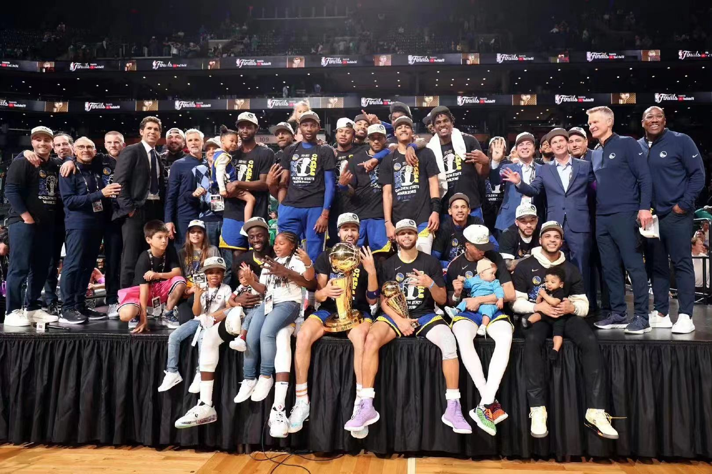

## Welcome to My GitHub Pages
***From Baby to Gaint. This is All You Need!***
<iframe frameborder="no" border="0" marginwidth="0" marginheight="0" width=330 height=86 src="//music.163.com/outchain/player?type=2&id=1806635538&auto=1&height=66"></iframe>

### Linux

### Tools
1. **IDE:**[VScode](https://blog.csdn.net/weixin_50821119/article/details/110528064)
2. **Remote Sever:**[MobaXtrem](https://mobaxterm.mobatek.net/)
3. **Paper Management Software:**[Mendeley](https://www.mendeley.com/)

### Books & Lessons
1. [Deep Learning from Scratch](books/DL from scratch.pdf) 
2. [Road 2 Coding](https://r2coding.com)

### Papers Reading
1. [BERT-Based Model](_post/Paper Reading/BERT-Based Model.md)

### Data Structures & Algorithm Analysis

### Programming Language

### Framework
1. [TensorFlow](_post/Framework/TensorFlow.md)
2. [PyTorch](_post/Framework/PyTorch.md)

### Python Library
1. [all kinds of Python Library](image/Python 库类大全.png)
2. [hyperparameters tuning and feature selection](https://github.com/rodrigo-arenas/Sklearn-genetic-opt)

### About Ph.D
1. [what you have to considerate before you want to be a doctor ](https://gong.ustc.edu.cn/2022/0107/c21173a559545/page.htm)

### Personal Learning
1. [Github Pages](_post/Github Pages.md)
2. [Websites](_post/Websites.md)
