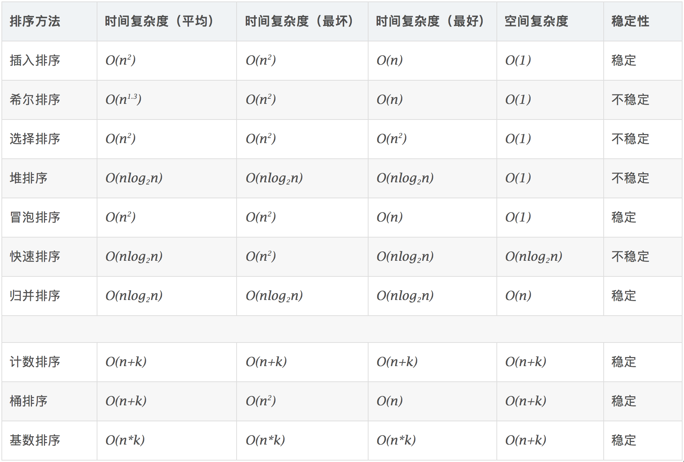

# 408-数据结构

这一模块记录一些关于数据结构的基础知识，摘自考研408-数据结构课程的分类。
## 一、绪论

1、数据结构三要素：逻辑结构（线性、非线性）、物理结构（顺序、链式、索引、哈希）、运算（定义、实现）

2、优秀算法：正确性、可读性、健壮性、时间空间高效

## 二、线性表

1、如果参数需要改变，则用引用调用（`ListDelete(&L, i, &e)`），否则用传值调用（`PrintList(L)`）

2、分为顺序表、链式表

3、静态分配（`int data[MaxSize]`）、动态分配（`data = new int[MaxSize]`）

4、删除单链表结点的`O(1)`算法：将待删除结点的后一结点的值赋给待删除结点，然后删除待删除结点的后一结点

5、静态链表：用数组来表示单链表，`next`指针用数组下标表示（适用于不支持指针的低级语言）

## 三、栈和队列

1、栈的链式存储结构：所有操作都在单链表的表头进行

2、循环队列判队满：牺牲一个空间来区分队空和队满、增设`size` 表示元素个数、增设`tag` 区分是由删除还是插入进而区分队空和队满

3、栈的应用：括号匹配、表达式求值（前中后缀的计算和相互转换）、递归

4、队列的应用：缓冲区、CPU资源分配队列、图的广度遍历

## 四、矩阵

1、一维矩阵的存储结构：`a[i]的存放地址= LOC + i * sizeof(ElemType)`

2、二维矩阵`M x N`的存储结构：若按行优先存储，则`b[i][j]的存储地址= LOC + (i*N + j) * sizeof(ElemType)` 若按列优先存储，则`b[i][j]的存储地址= LOC + ( j*M+ i ) * sizeof(ElemType)`

3、压缩存储：指为多个值相同的元素只分配一个存储空间，对零元素不分配空间（可以还原）

4、特殊矩阵的压缩存储：对称矩阵、三角矩阵、三对角矩阵、稀疏矩阵（用三元组压缩存储，相较于前面的压缩存储，这种方式失去了随机存取特性）

## 五、字符串

1、串的存储结构：定长顺序存储（静态）、堆分配存储（动态）、块链存储（一个结点是一个块，块的大小自由指配）

2、串的模式匹配：简单模式匹配、KMP、KMP优化

## 六、树

1、树的性质

- 高度为`h`的`m`叉树至多有`((m^h)-1)/m-1`个结点
- 结点的度：有几个孩子（分支）
- 树的度：各结点的度的最大值
- 高度为`h`、度为`m`的树至少有`h+m-1` 个结点
- 具有`n`个结点的`m`叉树的最小高度为`logm(n(m - 1) + 1)`
- `m`叉树只限定孩子最多只能是`m`个

2、特殊二叉树

- 满二叉树：按层序从`1` 开始编号，结点`i` 的左孩子为`2i`，右孩子为`2i+1`；结点`i`的父结点为 `i//2` （如果有的话）
- 完全二叉树：与满二叉树一一对应，但是可以不满
- 二叉排序树：左小右大
- 平衡二叉树：树上任一结点的左子树和右子树的深度之差不超过1
- 线索二叉树：在普通的二叉树中有近一半的指针出现了浪费，因为叶子节点的左右指针并没有指向任何的节点 所以我们要考虑把这些节点给利用起来，当没有左孩子的时候我们就让`lnode`指针指向自己的前驱 当没有右孩子的时候我们就让`rnode`指向自己的后驱。在初始化每个节点的时候添加两个标记字符 当标记字符为`1`的时候说明当前的`lnode`和`rnode`分别指向自己的前驱和后继 对当前树进行遍历的时候进行线索化

3、二叉树的存储结构：顺序存储（适合存储位置确定的、树比较满的满二叉树和完全二叉树，其他树可能需要大量空节点，因此不适合）链式存储（常用）

4、二叉树的遍历：先序（根左右）、中序（左根右）、后序（左右根）、层次遍历（队列）

```cpp
// 递归
void preorder(BiTree T){
	if (T != NULL) {
			visit(T);
			preorder(T -> lchild);
			preorder(T -> rchild);
	}
}

// 用栈实现非递归的遍历算法
void preorderNonrecursion(BTNode *bt)
{
    if(bt)
    {
        BTNode* stack[maxsize],p;
        int top=-1;
        stack[++top]=bt;
        while(top!=-1)
        {
            p=stack[top--];
            visit(p);
            if(p->rchild)//先检查右子树的原因是由于栈的"后进先出"特点，因为先序遍历是左右，所以为了确保左子树优先访问则应该让它后入栈
            {
                stack[++top]=p->rchild;
            }
            if(p->lchild)
            {
                stack[++top]=p->lchild;
            }
        }
    }
}

// 层次遍历
void levelorder(BiTree T){
	InitQueue(Q);
  BiTree p;
  EnQueue(Q, T);
	while (!isEmpty(Q)){
		DeQueue(Q, p);
    visit(p);
		if (p -> lchild != NULL){
			EnQueue(Q, p -> lchild);
		}
		if (p -> rchild != NULL){
			EnQueue(Q, p -> rchild);
		}
	}
}
```

5、线索二叉树的构造：就是根据遍历顺序（前中后序）来进行线索化

6、树、森林、二叉树的转换

- 树 → 二叉树：每个结点左指针指向它的第一个孩子，右指针指向它在树中的相邻右兄弟
- 森林 → 二叉树：
- 二叉树 → 森林：

7、树的应用

- 并查集
- BST：创建、插入、删除
- AVL
- 哈夫曼树和哈夫曼编码

## 七、图

1、基本概念

- 有向图和无向图
- 简单图（不存在重复边和顶点到自身的边）和多重图
- 有向完全图（任意顶点之间存在反向弧）和无向完全图（任意顶点之间存在边）
- 子图（顶点和边都是子集）和生成子图（顶点个数一致，边是子集）
- 连通图（任意顶点是连通的）和非连通图
- 连通分量：无向图中的极大连通子图
- 强连通图和强连通分量（和上面的一致，区别是上面指的是无向图，这里指的是有向图）
- 生成树（连通图中包含所有顶点的极小连通子图）、生成森林（由非连通图中每个连通分量的生成树组成的）
- 网：带权图
- 稠密图和稀疏图（`|E| < |V|log|V|`)
- 简单路径（经过的顶点不重复）

2、图的存储

- 邻接矩阵法（稠密图）
- 邻接表法（稀疏图）
- 十字链表（只能存有向图）
- 邻接多重表（只能存无向图）

3、图的遍历

- BFS（利用队列实现）
- DFS（利用栈实现）
- 图的遍历算法可以用来判断图的连通性

4、图的应用

- 最小生成树：Prim算法（从G中的**任意点开始**，选择关联的权重最小且不生成圈的边添加，直到得到最小生成树）、Kruskal算法（从G中的**最小边开始**，进行**避圈式**扩张）、破圈法（从赋权图G的**任意圈开始**， 去掉该圈中权值最大的一条边，称为破圈。不断破圈，直到G中没 有圈为止，最后剩下的G的子图为G的最小生成树）
- 最短路径：Dijksta（单源最短路径）、Floyd（各顶点之间最短路径）
- DAG描述表达式（把公共子式共享，以节省空间）
- 拓扑排序：AOV网（AOV指顶点表活动，AOE指边表示活动） → 选择没有前驱的顶点输出
- 逆拓扑排序：AOV网 → 选择没有后继的顶点输出
- 关键路径：

```markdown
**关键路径：**

- 从源点到汇点的有向路径可能有多条，所有路径中，具有最大路径长度的路径称为关键路径，而把关键路径上的活动称为关键活动
- 完成整个工程的最短时间就是关键路径的长度，若关键活动不能按时完成，则整个工程的完成时间就会延长
- 事件vk的最早发生时间ve(k)：决定了所有从vk开始的活动能够开工的最早时间
- 活动ai的最早开始时间e(i)：指该活动弧的起点所表示的事件的最早发生时间
- 事件vk的最迟发生时间vl(k)：它是指在不推迟整个工程完成的前提下，该事件最迟必须发生的时间。
- 活动ai的最迟开始时间l(i)：它是指该活动弧的终点所表示事件的最迟发生时间与该活动所需时间之差。
- 活动ai的时间余量d(i)=l(i)-e(i)，表示在不增加完成整个工程所需总时间的情况下，活动ai可以拖延的时间
- 若一个活动的时间余量为零，则说明该活动必须要如期完成，d(i)=0即l(i) = e(i)的活动ai是关键活动，
- 由关键活动组成的路径就是关键路径

**求关键路径的步骤：**

- 求所有事件的最早发生时间 ve( )
- 按拓扑排序序列，依次求各个顶点的 ve(k):
- ve(源点) = 0
- ve(k) = Max{ve(j) + Weight(vj, vk)}, vj为vk 的任意前驱
- 求所有事件的最迟发生时间 vl( )
- 按逆拓扑排序序列，依次求各个顶点的 vl(k):
- vl(汇点) = ve(汇点)
- vl(k) = Min{vl(j) - Weight(vk, vj)} , vj为vk的任意后继
- 求所有活动的最早发生时间 e( )
- 若边<vk, vj>表示活动ai，则有e(i) = ve(k)
- 求所有活动的最迟发生时间 l( )
- 若边<vk, vj>表示活动ai，则有l(i) = vl(j) - Weight(vk, vj)
- 求所有活动的时间余量 d( )
- d(i) = l(i) - e(i)
- d(i)=0的活动就是关键活动, 由关键活动可得关键路径

**关键活动、关键路径的特性：**

- 若关键活动耗时增加，则整个工程的工期将增长
- 缩短关键活动的时间，可以缩短整个工程的工期
- 当缩短到一定程度时，关键活动可能会变成非关键活动
- 可能有多条关键路径，只提高一条关键路径上的关键活动速度并不能缩短整个工程的工期，只有加快那些包括在所有关键路径上的关键活动才能达到缩短工期的目的。
```

## 八、查找

1、基本查找算法

2、B树（多路平衡查找树）和B+树

3、散列表映射函数

- 直接定址法：`H(key) = key` 或 `H(key) = a*key + b`
- 除留取余法：`H(key) = key % p`
- 数字分析法：在某些位上分布不均匀，只有某几种数码经常出现，此时可选取数码分布较为均匀的若干位作为散列地址
- 平方取中法：取关键字的平方值的中间几位作为散列地址

4、散列表处理冲突

- 开放定址法：指可存放新表项的空闲地址既向它的同义词表项开放，又向它的非同义词表项开放（线性探测、平方探测、再散列、伪随机序列）
- 拉链法：把所有同义词存在一个链表中，这个链表再由其散列地址唯一标识

## 九、排序


------
这一模块记录刷题和实践的过程。

## 1、刷题总结

### 1）已刷题单
这里列一下刷过的一些题单，可以在面试期间进行复习使用！

- [LeetCode 75](https://leetcode.cn/studyplan/leetcode-75/)
- [高频 SQL 50 题（基础版）](https://leetcode.cn/studyplan/sql-free-50/)
- [牛客网在线编程_编程学习](https://www.nowcoder.com/exam/oj?page=1&tab=%E7%AE%97%E6%B3%95%E7%AF%87&topicId=295&fromPut=pc_kol_aaaxiu)
- [LeetCode 热题 HOT 100 - 力扣（LeetCode）](https://leetcode.cn/problem-list/2cktkvj/)
- [剑指 Offer（第 2 版） - 力扣（LeetCode）](https://leetcode.cn/problem-list/xb9nqhhg/)
- [Leetcode List](https://www.notion.so/6c292f85ec6145fe94b5c6afaf733728?pvs=21)

这里列一下一些还不错的算法博客

- [小浩算法](https://www.geekxh.com/)
- [Hello 算法](https://www.hello-algo.com/)
- [CS自学指南](https://csdiy.wiki/)

### 2）经典题型
1、排序算法


[动画演示与算法实现](https://www.cnblogs.com/onepixel/articles/7674659.html)


2、查找算法
[七大查找算法](https://www.cnblogs.com/yw09041432/p/5908444.html)

3、搜索算法
- 递归与迭代
- DFS与BFS
- 回溯


4、分治算法
基本都可以用以下的模板
```python
def f(nums, target):
    l = 0
    r = len(nums) - 1
    while l <= r:
        m = (l + r) // 2
        if nums[m] < target:
            l = mid + 1
        elif nums[m] > target:
            r = mid - 1
        else:
            return m
    # 没找到
    return -1
    
```

5、贪心算法

6、动态规划
回溯法可以参考这个模板
```python
# 生成全排列
class Solution:
    def permute(self, nums):
        """
        :type nums: List[int]
        :rtype: List[List[int]]
        """
        def backtrack(first = 0):
            # 所有数都填完了
            if first == n:  
                res.append(nums[:])
            for i in range(first, n):
                # 动态维护数组
                nums[first], nums[i] = nums[i], nums[first]
                # 继续递归填下一个数
                backtrack(first + 1)
                # 撤销操作
                nums[first], nums[i] = nums[i], nums[first]
        
        n = len(nums)
        res = []
        backtrack()
        return res
```

7、图论算法

8、数论算法

### 3）经验记录
1、牛客输入输出模板

2、如何判断是否超时超空间？

3、当样例通过率不是100\%时，该如何debug？

4、有哪些需要注意的输出处理函数？

5、内置的sort原理是什么？

6、为什么判断元素在不在set要比list快很多？

7、为什么链表的题目大多都在头结点前面加一个虚拟结点？
在链表的题目中，十道有九道会用到哨兵节点。哨兵节点，其实就是一个附加在原链表最前面用来简化边界条件的附加节点，它的值域不存储任何东西，只是为了操作方便而引入。需要注意链表的指针更新之后能否找到相关结点，一般使用递归和迭代两种做法。遇到寻找第k个的问题，可以使用快慢指针，使得只需要遍历一遍。环形链表题目一般都是使用双指针法解决的，例如寻找距离尾部第 K 个节点、寻找环入口、寻找公共尾部入口等。

8、要掌握哪些位运算的技巧？
- `对于十进制整数 x，我们可以用 x & 1 得到 x 的二进制表示的最低位，它等价于 x % 2：例如当 x = 3 时，x 的二进制表示为 11，x & 1 的值为 1；例如当 x = 6 时，x 的二进制表示为 110，x & 1 的值为 0。`

- `对于十进制整数 x，我们可以用 x & (1 << k) 来判断 x 二进制表示的第 k 位（最低位为第 0 位）是否为 1。如果该表达式的值大于零，那么第 k 位为 1：例如当 x = 3 时，x 的二进制表示为 11，x & (1 << 1) = 11 & 10 = 10 > 0，说明第 1 位为 1；例如当 x = 5 时，x 的二进制表示为 101，x & (1 << 1) = 101 & 10 = 0，说明第 1 位不为 1。`

- `对于十进制整数 x，我们可以用 (x >> k) & 1 得到 x 二进制表示的第 k 位（最低位为第 0 位）。如果 x 二进制表示的位数小于 k，那么该表达式的值为零：例如当 x = 3 时，x 的二进制表示为 11，(x >> 1) & 1 = 1 & 1 = 1，说明第 1 位为 1；例如当 x = 5 时，x 的二进制表示为 101，(x >> 1) & 1 = 10 & 1 = 0，说明第 1 位为 0。例如当 x = 6 时，x 的二进制表示为 110，(x >> 3) & 1 = 0 & 1 = 0，说明第 3 位为 0。`

9、python里面如何使用队列、堆、栈？
队列(deque)、栈(stack，用list实现即可)、最小堆(heapq)

10、数组如何减少时间复杂度？
数组的题目常使用快慢指针、双指针、滑动窗口的方式来减少时间复杂度


