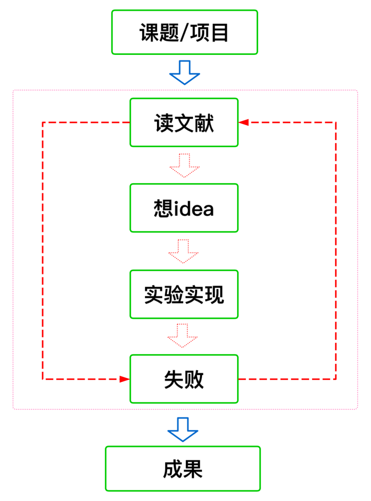

# 我的科研观   
科研到底是什么？怎样才能正确高效地上道？我想这是每一个研究生初次入门窥探都会问自己的问题。因此，在研一结束之际，我也以自己浅显的视角来尝试回答一下这个问题。    
对于一个初来乍到的研究生来说，阅读周志华老师的这篇[做研究与写论文](https://zhuanlan.zhihu.com/p/98747105)能够让你对所谓的科研有了一个大致的认知。    
按照我的理解，可以表达为下面的流程图。
 

   

 另一方面，也可以看看知乎这篇[博客](https://www.zhihu.com/question/478158497)    
 关注一些[国际会议](https://zhuanlan.zhihu.com/p/99619745)    
 [谷歌学术](https://scholar.google.com.hk/?hl=zh-CN)]上follow一些学者，并且订阅邮件，以获取最新的工作推送   
 [如何查全一个方向的文献](https://www.zhihu.com/question/437643499/answer/1772345677)   
 记录几个每天看最新论文的网站：ArxivDaily、[labml](https://papers.labml.ai/papers/recent/)